# **SISTEMA DE TURNOS**

# Manual de usuario

Este manual describe la utilización del sistema de turnos en su versión MVP.  El término MVP se refiere a la posibilidad de entregar un producto con los mínimos requerimientos pero funcional, de manera de ir testeando en vivo si lo primero que se desarrolló es lo que se buscaba y sobre una base testeada de trabajo, ir agregando funcionalidades que enriquezcan el producto.

## Tabla de contenidos
  * [1. Descripción de entidades del sistema](#entidades)
  * [2. Carga inicial de datos](#cargaInicial)
  * [3. Usuarios y roles del sistema](#usuarios)
    * [3.1 Cambio de contraseña](#cambioPass)
  * [4. Turnos](#turnos)
    * [4.1 Dar un nuevo turno](#nuevoTurno)  
    * [4.2 Dar un sobreturno](#sobreTurno)  
    * [4.3 Recordatorios por mail y mensaje de texto (SMS)](#recordatorios)   
    * [4.4 Ver turnos de un profesional](#turnosDeProfesional)
    * [4.5 Ver turnos de un paciente](#turnosDePaciente)
    * [4.6 Cancelar un turno](#cancelarTurno)
    * [4.7 Informar turnos cancelados a pacientes](#informarCancelados)
    * [4.8 Marcar presente un turno](#marcarPresente)
  * [5. Pacientes](#pacientes)
    * [5.1 Nuevo paciente](#nuevoPaciente)  
    * [5.3 Modificar o eliminar paciente](#modificarEliminarPaciente)
  * [6. Agendas](#agendas)
    * [6.1 Alta de agenda](#altaAgenda)
      * [6.1.1 Renovación de agenda](#renovacionAgenda)       
    * [6.2 Modificación o eliminar agenda](#modificarEliminarAgenda)
    * [6.3 Calendario](#calendario)
    * [6.4 Imprimir agenda de un profesional](#imprimirAgenda)
  * [7. Profesionales](#profesionales)
    * [7.1 Listado de profesionales](#listadoProfesionales)
    * [7.2 Alta de profesional](#altaProfesionales)
    * [7.3 Modificar o eliminar profesional](#modificarEliminarProfesional)   
    * [7.4 Ver turnos de un profesional](#turnosDeProfesional)
    * [7.5 Ausencias](#ausencias)
      * [7.5.1 Ver ausencias de un profesional](#listadoAusencias)
      * [7.5.2 Cargar nueva ausencia de un profesional](#nuevaAusencia)
      * [7.5.3 Eliminar ausencia de un profesional](#eliminarAusencia)  
  * [8. Especialidades](#especialidades)
    * [8.1 Listado de especialidades](#especialidades)
    * [8.2 Alta de especialidades](#altaEspecialidades)
    * [8.3 Modificar o eliminar una especialidad](#modificarEliminarEspecialidad)
  * [9. Prestaciones](#prestaciones)
    * [9.1 Listado de prestaciones](#prestaciones)
    * [9.2 Alta de prestaciones](#altaPrestaciones)
    * [9.3 Modificar o eliminar una prestación](#modificarEliminarPrestacion)

<a id="entidades"/>
## 1. Descripción de entidades del sistema

●	Profesional: son los médicos, enfermeras o cualquier persona que brinde un servicio para el cual se necesite asignar un turno

●	Especialidad: generalmente es la especialidad del médico, por ejemplo: Infectología, Dermatología, Clínica Médica, etc.

●	Prestación: es el servicio en sí que se asocia a un único turno. Una especialidad debe tener una o más prestaciones relacionadas; además una prestación tiene una duración, que representa la duración del turno.

Cada prestación puede tener una duración distinta, siguiendo el ejemplo mencionado, se podría asignar una duración de 40min a la prestación “Consulta primera vez”, y una duración de 20min a la prestación “Seguimiento”.

●	Turno: se debe ingresar por lo menos el nombre, apellido y teléfono de un paciente. A su vez, se debe seleccionar la especialidad/prestación, profesional, fecha y hora del turno elegido.

●	Agenda: representan los días y horarios que tiene disponible un profesional para cada especialidad/prestación que atiende

●	Ausencia: un profesional puede estar ausente por Congreso, Vacaciones, Otros. El sistema permite registrar dicha ausencia para evitar dar turnos que no se podrán atender y/o listar los turnos cancelados por ese registro de ausencia. Tener en cuenta que si se está dando un sobreturno, no se toma en cuenta si el profesional estará ausente.

●	Sobreturno: son turnos que se dan sin tener en cuenta si el profesional tiene una agenda abierta, si ya tiene un turno tomado o si estará ausente. Estos turnos funcionan por fuera de la agenda del profesional.

<a id="cargaInicial"/>
## 2. Carga inicial de datos

Para que se puedan dar turnos, se deben cargar previamente determinados datos en el siguiente orden:

 1. [Dar de alta las nuevas especialidades](#altaEspecialidades)

 2. [Dar de alta las nuevas prestaciones de cada especialidad](#altaPrestaciones)

 3. [Dar de alta los nuevos profesionales](#altaProfesionales)

 4. [Abrir agendas de cada profesional, especialidad/prestación](#altaAgenda)

 <a id="usuarios"/>
## 3. Usuarios y roles

Los usuarios del sistema son creado por el administrador. Cada usuario tiene un rol que le da permisos para poder realizar distintas acciones. Por ejemplo, un usuario puede tener permisos para dar un nuevo turno, pero se puede dar el caso que no tenga permiso para dar de alta una nueva agenda

Para más información sobre usuarios y roles, por favor consulte con el administrador.

<a id="cambioPass" />
#### 3.1 Cambio de contraseña

Para cambiar la contraseña se debe hacer click arriba a la derecha donde está el nombre del usuario y elegir la opción "Cambiar contraseña" tal como se ve en la siguiente imagen:

Luego, se debe ingresar la contraseña actual, y la nueva contraseña

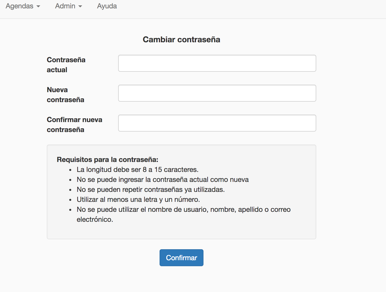

El sistema avisa que la contraseña ha sido modificada correctamente

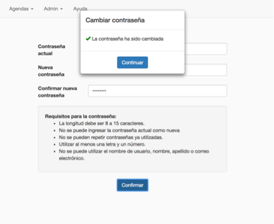

<a id="turnos" />
<a id="nuevoTurno" />
## 4. Turnos

### 4.1 Dar un nuevo turno

Hay tres pasos que deben seguirse para poder dar un turno:

<a id="datosPacienteTurnos" />
#### Paso 1: Ingresar los datos del paciente

<a id="turnoPacienteNuevo" />
**a.	Paciente nuevo**

Si se quiere dar un turno a un paciente que no existe en el sistema se debe ingresar obligatoriamente el nombre, apellido y número de teléfono.
Además de estos datos también se pueden agregar el tipo de documento, número de documento, email y fecha de nacimiento.

Luego se procede con el paso 2. [Búsqueda de turnos disponibles](#buscarTurno)

**b.	Paciente ya existente**

Para buscar un paciente ya existente hay dos opciones:

i.	_Nombre y apellido_: se deben ingresar al menos las 3 primeras letras del nombre y del apellido

ii.	_Tipo y número de documento_: seleccionar el tipo de documento e ingresar el número de documento

Una vez seleccionado el paciente del listado, se procede con el paso 2. [Búsqueda de turnos disponibles](#buscarTurno)

Es importante que en el campo Número de Teléfono este cargado el número de celular, para que de esta forma se envie el recordatorio del turno al paciente. El formato de celular deberá ser (codigo de area) y celular; por ejemplo para un celular de la Ciudad de Buenos Aires el número sería 1150884500

Con respecto al campo email, se debe ingresar el email del paciente para que el sistema pueda enviar automáticamente el recordatorio del turno.

<a id="buscarTurno" />
#### Paso 2: Búsqueda de turnos disponibles

Para poder buscar un turno disponible se debe ingresar los datos del turno en el siguiente orden:

1) Especialidad
2) Profesional
3) Prestación

En 2) Profesional se puede seleccionar la opción _Todos los médicos_ para buscar todos los turnos únicamente por especialidad/prestación

Si además es necesario, buscar un turno a partir de una fecha dada, se puede utilizar el campo _**A partir del día**_.
Si se necesita agregar información adicional del turno, se podrá utilizar el campo _**Notas**_.

#### Paso 3: Seleccionar turno disponible

Se debe seleccionar el turno disponible ya sea en el Calendario o el Listado.

Luego, al clickear el botón Confirmar se mostrará la información del nuevo turno dado.

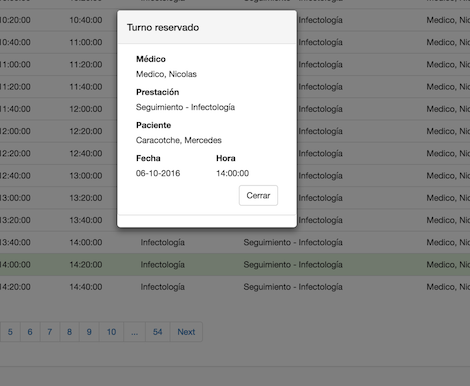

<a id="sobreTurno" />
### 4.2 Dar un sobreturno

Es importante tener en cuenta que un sobreturno puede ser dado aún si el profesional está ausente o si no posee agendas abiertas.

El sobreturno puede ser para cualquier día y horario futuro, y se manejará por fuera de las agendas de los profesionales.

Para poder dar un sobre turno se debe ir a la opción Turnos del menú principal y luego elegir la pestaña Sobreturnos.

Allí primero se deben ingresar los datos del paciente tal como se realiza al dar un nuevo turno: [ingresar los datos del paciente](#datosPacienteTurnos)

Luego se deberá ingresar el profesional, prestación, fecha y horario del sobreturno.

Al hacer click en Confirmar, se mostrará la información del sobreturno dado.

<a id="recordatorios" />
### 4.3 Recordatorios por mail y mensaje de texto

El sistema envia automáticamente un recordatorio al paciente a su email y número de celular únicamente cuando estos datos están cargados.

<a id="turnosDeProfesional" />
### 4.4 Ver turnos de un profesional

Para ver los turnos de un profesional se debe ir a la opción de menú Admin -> Profesionales donde se deberá seleccionar el profesional del cual se quiere ver los turnos.

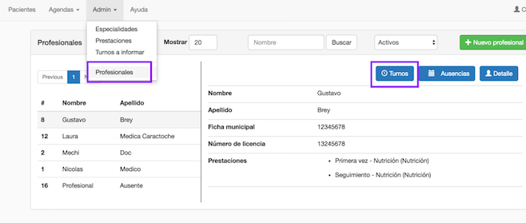

Al clickear el botón de Turnos se verá lo siguiente:

<a id="turnosDePaciente" />
### 4.5 Ver turnos de un paciente

Los turnos de un paciente se pueden ver al visualizar el Detalle de un paciente. En el detalle se ven los datos personales del paciente,  y además los turnos del mismo.

Para ver los turnos de un paciente, se debe ir a la opción Admin -> Pacientes, y de allí seleccionar el paciente:

Al clickear el botón de Turnos se verá el detalle del paciente y los turnos del mismo:

<a id="cancelarTurno" />
### 4.6 Cancelar un turno

Haciendo click en el botón , se puede cancelar un turno desde:
* [3.3 Ver turnos de un profesional](#turnosDeProfesional)
* [3.4 Ver turnos de un paciente](#turnosDePaciente)

También se puede cancelar desde la vista **Agendas -> Calendario**

Al hacer click sobre el turno tomado, se puede ver el detalle del turno, y el botón para cancelar el mismo

<a id="informarCancelados" />
### 4.7 Informar turnos cancelados a pacientes

Hay turnos que son cancelados **_por el sistema_**, esto ocurre únicamente:

a. Por ingreso de **nueva ausencia**

Cuando el usuario ingresa una nueva ausencia del profesional, se cancelan los turnos tomados de este profesional para los días de la ausencia. Por ejemplo, si ya hay turnos tomados para el 1/10 para un profesional, y se le carga una ausencia para el 1/10, éstos serán cancelados automáticamente y se deberá **informar al paciente** lo ocurrido.

<a id="turnosAInformarModificacionAgenda" />
b. Por **modificación en la agenda** de un profesional

Cuando se modifica los días u horarios de atención de un profesional, los turnos tomados serán cancelados por el sistema. Por ejemplo, si hay un turno tomado para el miércoles 1/10 a las 10am; y se modifica la agenda de forma tal que el profesional deja de atender los miércoles 10am, este turno tomado pasa a cancelado automáticamente y se deberá **informar al paciente** de lo ocurrido.

_En ambos casos, los turnos que son cancelados por el sistema se pasan a un estado de "Turnos a Informar" que se pueden ver en la opción de menú Admin -> Turnos a informar_

Allí se puede ver los datos de contacto (teléfono) de los pacientes cuyos turnos fueron cancelados automáticamente para que el usuario pueda ponerse en contacto con el mismo e informarle que su turno ha sido cancelado.

Una vez que el paciente es informado de la cancelación de su turno, se debe clickear el botón "Informar" para poder marcar el turno como "Ya informado"

Luego, si se cambia el filtro para ver únicamente los turnos ya informados, se podrá ver el turno que recientemente se marcó como "Ya informado"

_Nota: En la lista de turnos a informar, no se ven aquellos turnos que son cancelados por usuarios del sistema, por ejemplo, cuando un paciente llama por teléfono para cancelar el turno, el usuario debe ingresar la cancelación "manualmente" como se describe en [Cancelar un turno](#cancelarTurno)_

<a id="marcarPresente" />
### 4.8 Marcar presente un turno

Para marcar como presente un turno se debe ir a Agendas -> Calendario

Se debe hacer click en el turno para ver el detalle del mismo y marcarlo como presente

En el calendario, se podrá distinguir el turno marcado como presente ya que está pintado de verde suave

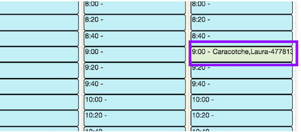

## 5. Pacientes

<a id="nuevoPaciente" />
### 5.1 Alta de paciente

Para dar de alta un paciente se debe seleccionar la opción Nuevo Paciente del menú y luego en el formulario cargar los datos del paciente. Para que un paciente sea dado de alta, minimamente se deberan cargar los campos obligatorios: Nombre, Apellido paterno, Tipo de documento, Número de documento y Teléfono y clickear el botón verde de Confirmar.

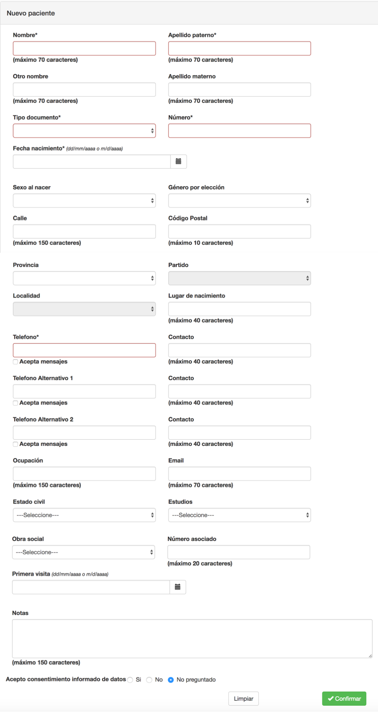

<a id="modificarEliminarPaciente" />
### 5.2 Modificar o eliminar paciente

Para poder ver el detalle de un paciente, modicar o borrar la información del mismo, desde la pantalla Turnos, se debe buscar el paciente por algún criterio de busqueda tal como se hace cuando se busca un turno.
Una vez que se encuentra el paciente, se debe hacer click en la lupa para que se abra la pantalla con la información detallada del paciente seleccionado.

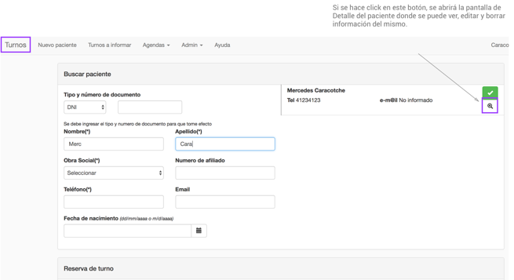

Luego de hacer click en Detalle/Modificar se va al mismo formulario que se ve al crear un nuevo paciente donde se puede:

- modificar datos personales del paciente
- ver turnos del paciente
- cancelar un turno del paciente
- eliminar el paciente

<a id="agendas" />
## 6. Agendas

Un profesional puede tener una o varias agendas. Cada agenda representa los turnos disponibles que tiene un profesional para una especialidad/prestación especificando los días y horarios de atención.

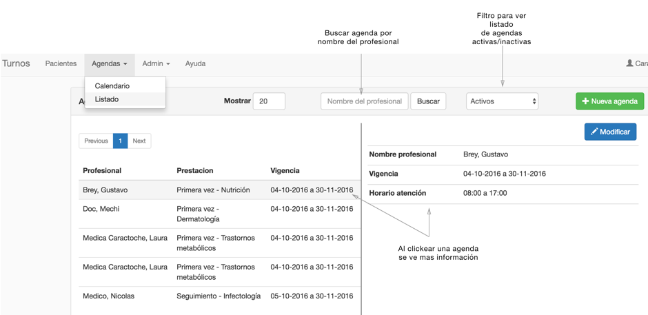

<a id="altaAgenda" />
### 6.1 Alta de agenda

Para abrir una nueva agenda de un profesional se debe ir a Agendas -> Listado y clickear el botón Nueva Agenda

Al clickear el botón Nueva Agenda, se mostrará la siguiente pantalla dónde se deberá elegir el profesional, especialidad y prestación de la agenda a abrir:

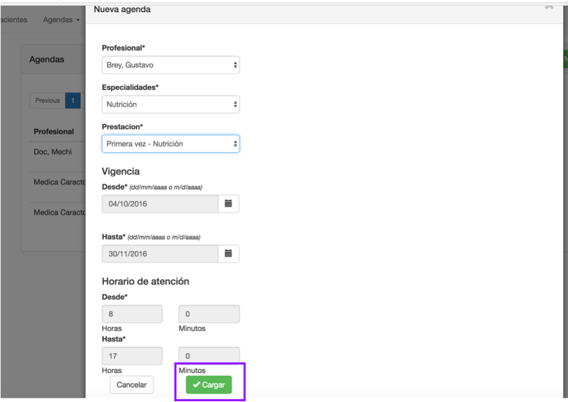

Se deberá hacer click en el botón Cargar para poder elegir los horarios y días de atención para esta agenda.

Por ejemplo:

La grilla horaria, indica que el profesional Brey, Gustavo atenderá Nutrición/Primera vez los días Lunes, de 8 a 13hs.

Luego se deberá hacer click en el botón Confirmar, y se verá la nueva agenda en el listado.

#### 6.1.1 Renovación de agenda

Para facilitar la renovación de agendas de profesionales, se puede utilizar la opción de Renovar agenda. Primeramente se selecciona del listado de agendas cual se quiere renovar, y luego se debe hacer click en el botón Renovar que se muestra a continuación.

Se podrá ver la agenda pre-cargada con los dias y horarios de la agenda que se selecciono renovar y se pueden realizar cambios para la renovación de la nueva agenda. Una vez realizados estos cambios, se debe hacer click en Confirmar tal como se realiza cuando se crea una nueva agenda.

<a id="modificarEliminarAgenda" />
### 6.2 Modificar o eliminar agenda

Para modificar una agenda, se deberá ir al listado, seleccionar la agenda a modificar y clickear el botón modificar

Únicamente se podrán modificar los días/horarios de atención del profesional. Hay que tener en cuenta que una vez modificada la agenda el sistema cancelará automáticamente los turnos que se vean afectados por el cambio. Esta situación deberá ser informada al paciente tal como se explica en [turnos a informar](#turnosAInformarModificacionAgenda)
<a id="calendario" />
### 6.3 Calendario

La vista Calendario se utiliza para poder ver los turnos de un profesional e imprimir su agenda. Primero se deben ingresar los filtros de nombre de profesional, especialidad y prestación y hacer click en el botón Buscar. Se deben ingresar los filtros para poder ver los turnos en el calendario, de lo contrario, no se mostrará ningún turno.

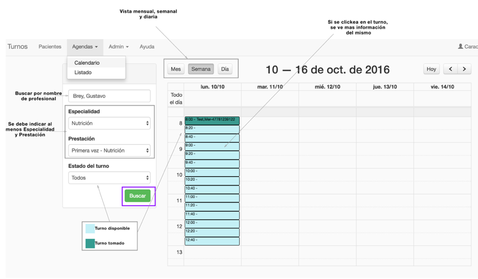

<a id="imprimirAgenda" />
### 6.4 Imprimir agenda de un profesional

Para imprimir la agenda de un médico se deberá hacer click en el botón derecho y elegir la opción de Imprimir.

<a id="profesionales" />
## 7. Profesionales

Se debe ir a Admin -> Profesionales

<a id="listadoProfesionales" />
### 7.1 Listado de profesionales

Allí se mostrará el listado de profesionales, y se podrá:
- buscar un profesional por nombre
- filtrar listado por profesional activos/inactivos
- crear nuevo profesional
- modificar o eliminar profesional

Al hacer click en cada profesional del listado se verá mas información, junto con las opciones de Turnos, Asistencias y Detalle

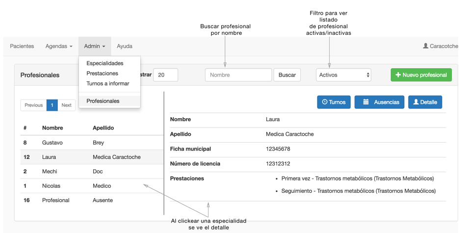

Al clickear el botón de Turnos, se pueden [ver los turnos del profesional](#turnosDeProfesional)

Al clickear el botón de Ausencias, se puede [ver las ausencias de un profesional](#listadoAusencias) , [cargar nueva ausencia](#nuevaAusencia) y [eliminar ausencia](#eliminarAusencia)

Al clickear el botón de Detalle, se visualizan los datos personales del profesional, [se puede modificar sus datos, especialidad/prestación o eliminarlo](#modificarEliminarProfesional).

El mismo formulario de detalle de profesional es utilizado por el alta, modificación o eliminación del profesional.

<a id="altaProfesionales" />
### 7.2 Alta de profesional

Para dar de alta un profesional, se deberá hacer click en Nuevo Profesional, del listado de profesionales y llenar los campos con los datos personales del profesional junto con la especialidad y prestaciones que atienda. Los datos obligatorios a cargar son Nombre, Apellido paterno, Ficha municipal, Número de matricula, Especialidad y Prestaciones.

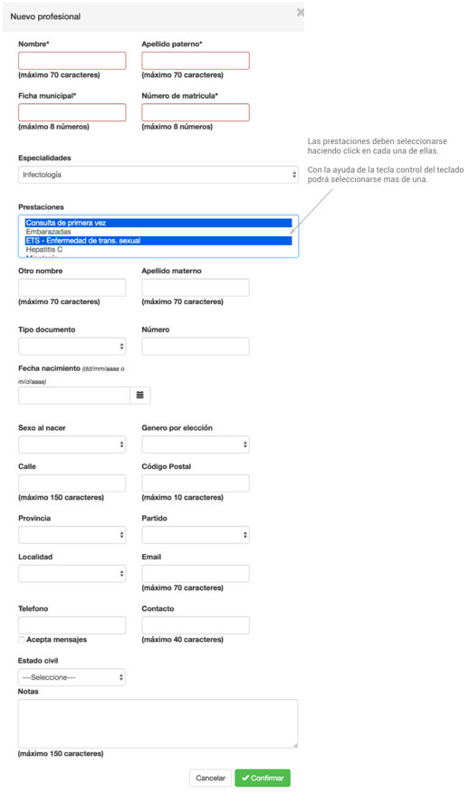

<a id="modificarEliminarProfesional" />
### 7.3 Modificar o eliminar profesional

Para modificar un profesional, se deberá seleccionar el profesional del listado y luego clickear el botón de Detalle para poder modificar datos del profesional, cambiar especialidad y/o prestación. También desde allí se puede Eliminar el profesional.

<a id="turnosDeProfesional" />
### 7.4 Ver turnos de un profesional

Para poder ver los turnos de un profesioanles, se debe seleccionar el profesional del listado y seleccionar la opción Turnos.
Allí se muestran los turnos del día del profesional, como así también los turnos futuros que ya tiene tomados.

Para cancelar el turno hacer click en el botón X

<a id="ausencias" />
<a id="listadoAusencias" />
### 7.5 Ausencias

#### 7.5.1 Ver ausencias de un profesional

Para ver el listado de ausencias de un profesional se deberá ir a Admin -> Profesionales, y de allí seleccionar el botón de Ausencias del profesional que mostrará lo siguiente:

<a id="nuevaAusencia" />
#### 7.5.2 Cargar nueva ausencia de un profesional

Clickeando el botón de Nueva Ausencia que se ve en el listado, se cargará el siguiente formulario:

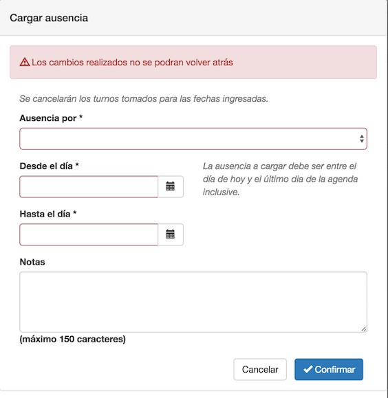

Se puede dar el caso, que la ausencia ingresada cancele turnos ya tomados. Para ver los turnos cancelados que deben informarse se deberá ir a [Turnos a informar](#informarCancelados)

<a id="eliminarAusencia" />
#### 7.5.3 Eliminar ausencia de un profesional

En caso de necesitar borrar la ausencia de un profesional, se debe clickear la X de la ausencia a borrar, y confirma la eliminación de la misma.

## 8. Especialidades

### 8.1 Listado de especialidades
Para ver las especialidades se debe ir a Admin -> Especialidades

Se muestra el listado de especialidades donde se puede:
-	buscar una especialidad por nombre
-	filtrar listado por especialidades activas/inactivas
-	crear nueva especialidad
-	modificar una especialidad

<a id="altaEspecialidades" />
### 8.2 Alta de especialidades

Al hacer click en el botón Nueva especialidad.

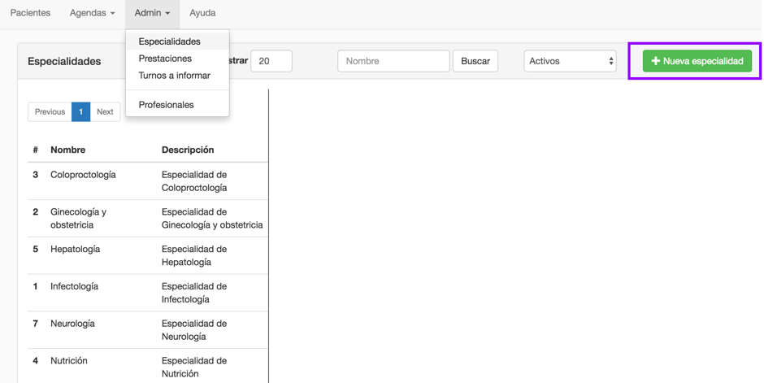

Se debe ingresar obligatoriamente el nombre de la especialidad. A su vez, se puede ingresar una descripción de la nueva especialidad.

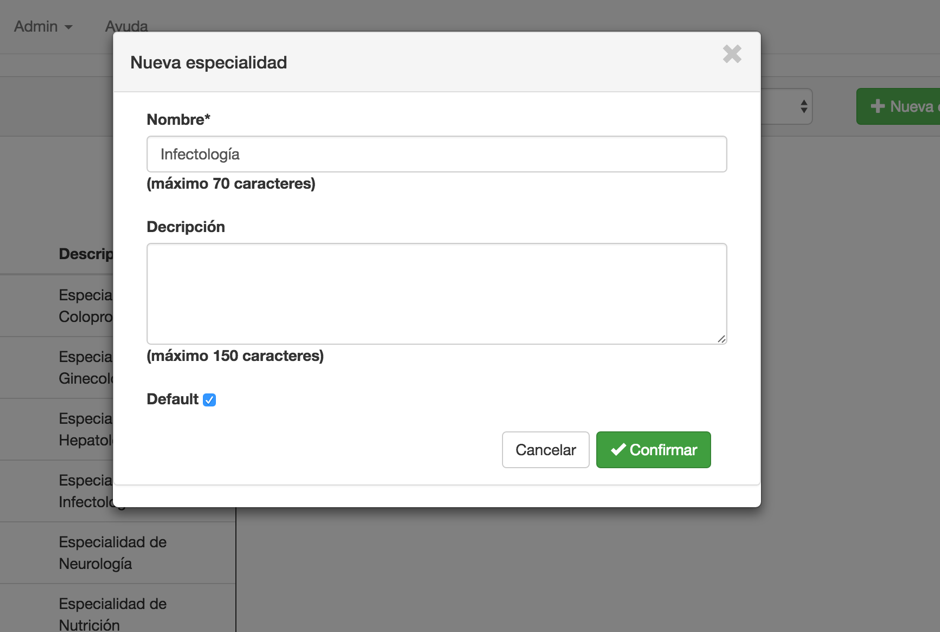

<a id="campoDefault" />
El campo Default se utiliza para definir si la especialidad ingresada debe aparecer primera en los combos donde se muestre el listado de especialidades. Por ejemplo, si frecuentemente se utiliza la especialidad Infectología, se marca el checkbox y luego en la pantalla de Nuevo Turno, se verá esta especialidad primera en el combo, tal como se muestra a continuación:

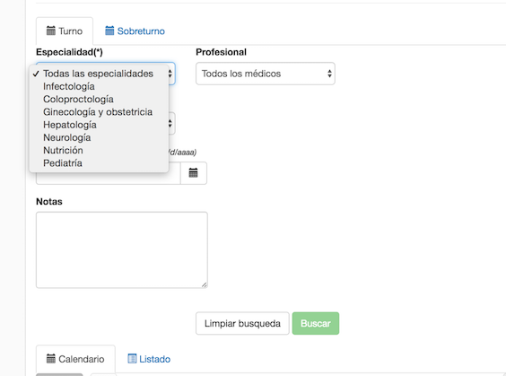

<a id="modificarEliminarEspecialidad" />
### 8.3 Modificar o eliminar una especialidad

Primero se debe seleccionar una especialidad del listado y luego hacer click en el botón Modificar

Para modifcar la especialidad, ingresar los cambios en nombre y descripción, luego hacer click en el botón Confirmar

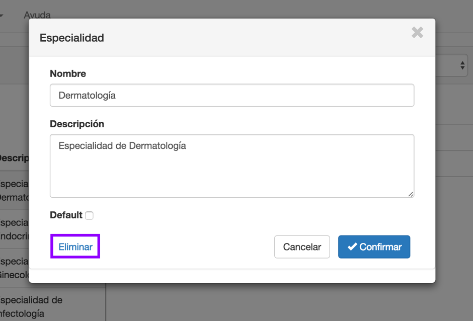

Para borrar la especialidad, hacer click en el botón Eliminar

<a id="prestaciones" />
## 9. Prestaciones

### 9.1 Listado de prestaciones

Para ver las prestaciones se debe ir a Admin -> Prestaciones

Se muestra el listado de prestaciones donde se puede:
-	buscar una prestación por nombre
-	filtrar listado por prestaciones activas/inactivas
-	crear nueva prestación
- modificar una prestación

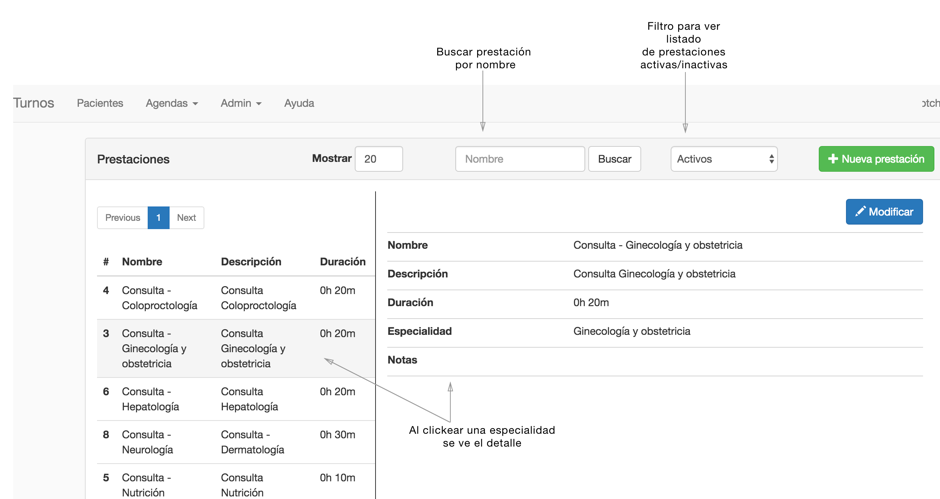

<a id="altaPrestaciones" />
### 9.2 Alta de prestaciones

Se deberá hacer click en el botón Nueva Prestación

Al clickear el botón Nueva Prestación se deben ingresar obligatoriamente el nombre, duración y especialidad.
Opcionalmente se puede utilizar el [campo Default](#campoDefault) tal como en Nueva Especialidad.
En el campo Notas se debe ingresar información propia de la prestación, por ejemplo si la prestación es un análisis de sangre, se pueden ingresar las indicaciones para poder realizarlo. Otro ejemplo, puede ser en Consulta de primera vez, se puede indicar que se le informe al paciente que debe venir antes para poder registrarse y abrir una nueva historia clínica.

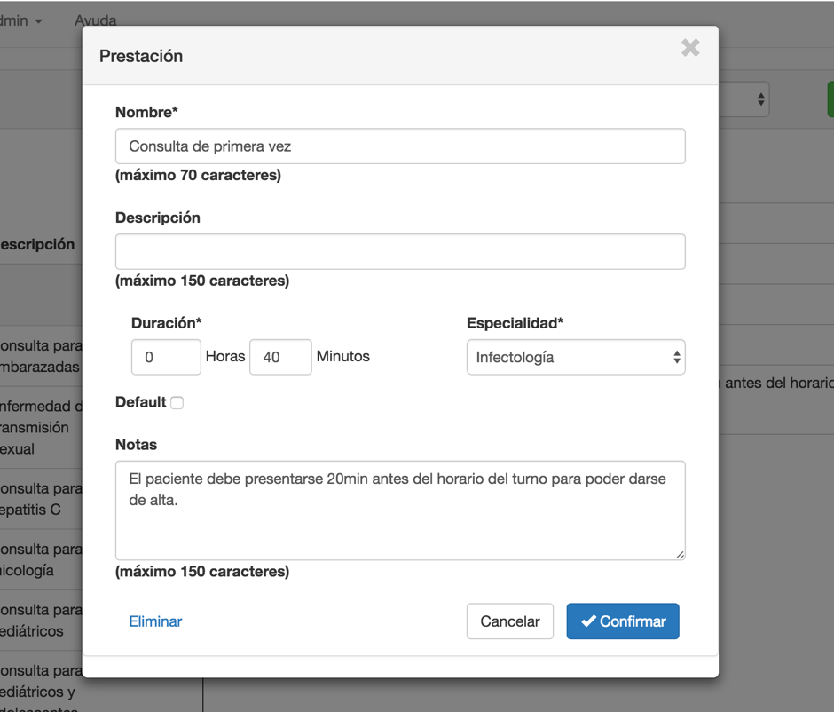

En la pantalla nuevo turno, se puede ver el campo Notas, como Observaciones:

<a id="modificarEliminarEspecialidad" />
